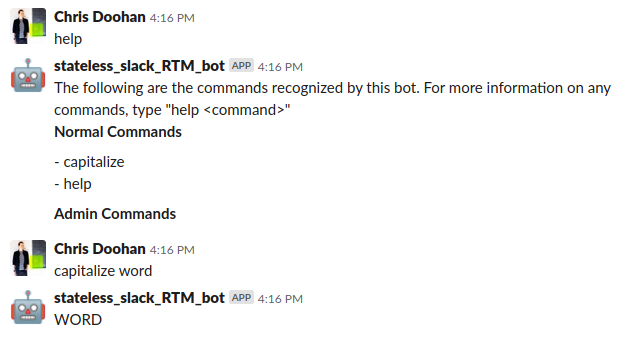

# About
This project is a simple stateless slack bot wrapping the Python Slack client. It allows you to accept messages from users and route these to registered callbacks, as well as return responses via direct message. Because it does this by opening a websocket, it can be used from inside a firewall without opening an incoming port. The original intention of this bot is as a remote interface to hardware controlled by a Raspberry Pi.

# Setting Up Your Slack Instance
To add a bot to Slack:
1. Go to api.slack.com.
1. Choose an app name.
1. Choose the team you want the app to interact with.
1. In the nav bar on the left, click "Bot Users" and then "Add a Bot User." Note that the display name is the name people will be able to DM the bot by, but the bot will be able to post as other usernames.
1. In the nav bar on the left, click "Install App" then "Install App to Workspace." Authorize the bot.
1. Save the "Bot User OAuth Access Token" somewhere secure.

# Using The Bot
1. Install the package
    ```bash
    pip install git+http://github.com/ChrisDoohan/stateless_slack_RTM_bot.git
    ```

1. Set an environment variable named `SLACK_BOT_TOKEN` equal to the bot access token from the slack setup step. How you do that is none of my business, but probably not by using `export SLACK_BOT_TOKEN=...` and leaving it in your bash history.

1. Create a config file such as the following, and name it `bot_config.json` (admin user is optional).
    ```json
    {
        "response_username": "stateless_slack_RTM_bot",
        "response_avatar": ":robot_face:",
        "admin_user_slack_id": "ABCDEF"
    }
    ```

1. Invoke the bot as follows:
    ```python
    import logging
    from stateless_slack_RTM_bot import SlackBot

    logger = logging.getLogger()
    logger.setLevel(logging.DEBUG)
    logger.addHandler(logging.StreamHandler())

    # Define user interaction with the bot
    invocation_string = 'capitalize'
    help_string = 'Returns user input but in upper case.'
    def convert_to_uppercase(s):
        return s.upper()

    # Create bot instance and start it
    bot = SlackBot('bot_config.json')
    bot.register_function(invocation_string,
                          convert_to_uppercase,
                          help_string)
    bot.start()
    ```

    If everything is set up properly, the bot should show as online in the Slack interface, and you should be able to interact with it like this:

    

# Modifying This Repo
1. Clone the repo

    `git clone git@github.com:ChrisDoohan/stateless_slack_RTM_bot.git && cd stateless_slack_RTM_bot`

1. Make a virtual environment in the manner of your choosing
1. Install requirements

    `pip install -r requirements.txt`

1. Run tests

    `python -m unittest tests`